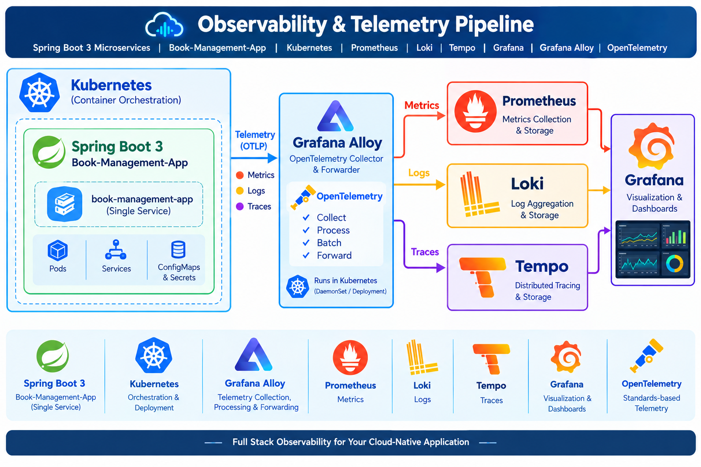

#  Kubernetes Orchestration - Spring Boot 3 Microservices Observability with OpenTelemetry & Grafana

## Overview

This project demonstrates an **end-to-end observability architecture for Spring Boot 3 microservices running on Kubernetes**. It provides a unified approach to collecting, processing, storing, correlating, and visualizing **application metrics, logs, and distributed traces** using the OpenTelemetry and Grafana observability ecosystem.

The architecture uses **Grafana Alloy** as the telemetry collection and processing layer. It receives telemetry generated by Spring Boot 3 microservices, processes and forwards it to the appropriate observability backends — **Prometheus for metrics, Loki for logs, and Tempo for distributed traces**. **Grafana** provides a unified visualization and troubleshooting experience across all three telemetry signals.


## 🏗️ Architecture Diagram




### Observability Stack

| Component          | Purpose                              | Description                                                                       |
|--------------------|--------------------------------------|-----------------------------------------------------------------------------------|
| **Java 17**        | Spring Boot runtime                  | LTS Java version used to run the application                                      |
| **Spring Boot 3**  | Build app                            | Provides REST APIs, Actuator, dependency management, and configuration            |
| **Maven**          | Build/package application            | Compiles code, manages dependencies, runs tests, and creates the JAR              |
| **Docker**         | Containerize application             | Packages the application into a portable container image                          |
| **Kubernetes**     | Deploy application                   | Runs, manages, scales, and restarts application containers                        |
| **kubectl + Helm** | Manage/install Kubernetes components | kubectl manages cluster resources; Helm simplifies installation and configuration |
| **OpenTelemetry**  | Generate telemetry                   | Provides standard instrumentation for metrics, logs, and traces                   |
| **Grafana Alloy**  | Collect & forward telemetry          | Receives, processes, and routes telemetry to the backends                         |
| **Prometheus**     | Metrics                              | Collects and stores time-series metrics                                           |
| **Loki**           | Logs                                 | Collects, stores, and queries application logs                                    |
| **Tempo**          | Traces                               | Stores distributed traces for request-flow and latency analysis                   |
| **Grafana**        | Visualization & dashboards           | Provides a single view of metrics, logs, and traces                               |

### Telemetry Flow
The target learning flow is:


```text
Spring Boot 3 Microservice
          │
          │  Metrics / Logs / Traces
          ▼
    Grafana Alloy
  OpenTelemetry Layer
          │
     ┌────┼────┐
     │    │    │
     ▼    ▼    ▼
Prometheus Loki Tempo
 Metrics  Logs  Traces
     │    │    │
     └────┼────┘
          ▼
       Grafana
 Visualization, Dashboards & Correlation
```

### Stack Verification 

Verify:

```powershell
docker version
kubectl version --client
helm version
git --version
java -version
```

Verify Kubernetes:

```powershell
kubectl config current-context
kubectl get nodes
```

For Docker Desktop Kubernetes, the context normally looks similar to:

```text
docker-desktop
```

If necessary:

```powershell
kubectl config use-context docker-desktop
```

---

### Recommended local resource settings

This stack can consume a reasonable amount of RAM.

In Docker Desktop:

```text
Settings
  -> Resources
```

Recommended starting point:

```text
CPU:     6+
Memory:  10 GB+
Disk:    50 GB+
```

If the machine has limited RAM, run fewer Spring Boot services and reduce Prometheus/Loki/Tempo retention.

---

### Directory - to start the installation & deployment

PowerShell:

```cmd
git clone https://github.com/satya-moganti/kubernetes-observability.git
cd kubernetes-observability
```

### Recommended structure:

```text
kubernetes-observability
|
+-- README.md
|
+-- k8s
|   +-- prometheus\values.yaml
|   +-- loki\values.yaml
|   +-- tempo\values.yaml
|   +-- alloy\otel-values.yaml
|   +-- alloy\logs-values.yaml
|   +-- deployment
|       +-- book-management-deployment.yaml
|       +-- book-management-service.yaml
|
+-- book-management-app
```


# Next Steps
#### 1. Helm Repositories
#### 2. Create the Namespace (`monitoring`)
#### 3. Install Prometheus + Grafana
#### 4. Access Prometheus and Grafana
#### 5. Install Loki
#### 6. Install Tempo
#### 7. Install Grafana Alloy
#### 8. Configure Grafana Data Sources
#### 9. Deploy Spring Boot Application


### 1. Add Helm repositories

Use the Prometheus Community repository and Grafana Community repository.

```powershell
helm repo add prometheus-community https://prometheus-community.github.io/helm-charts
helm repo add grafana https://grafana.github.io/helm-charts
helm repo add grafana-community https://grafana-community.github.io/helm-charts

helm repo update
```

Verify:

```powershell
helm repo list
```

You should see:

```text
prometheus-community
grafana
grafana-community
```

---

### 2. Create the namespace(`monitoring`)

```powershell
kubectl create namespace monitoring
```

If it already exists:

```powershell
kubectl get namespace monitoring
```

Set the namespace as the current kubectl context:

```powershell
kubectl config set-context --current --namespace=monitoring
```

Verify:

```powershell
kubectl config view --minify --output 'jsonpath={..namespace}'
```

Expected:

```text
monitoring
```

---

### 3. Install Prometheus  + Grafana

#### 3.1 Install:

```powershell
helm upgrade --install prometheus `
  prometheus-community/kube-prometheus-stack `
  --namespace monitoring `
  --values .\k8s\prometheus\values.yaml
```

#### 3.2 Verify:

```powershell
kubectl get pods -n monitoring
```

#### 3.3 Find Prometheus:

```powershell
kubectl get pods -n monitoring | Select-String prometheus

kubectl port-forward -n monitoring svc/prometheus-operated 9090:9090

kubectl port-forward svc/prometheus-grafana 3000:80 -n monitoring

```
### 4. Access Prometheus and Grafana

#### 4.1 Login to Grafana:
```text
http://localhost:9090 - opens Prometheus
http://localhost:3000 - Opens grafana

```
```text
Username: admin
Password: admin
```
Please change password in case of production and Other Setups

---

### 5. Install Loki
#### 5.1 Install

```powershell
helm upgrade --install loki `
  grafana-community/loki `
  --namespace monitoring `
  --values .\k8s\loki\values.yaml
```
#### 5.2 Verify :
```powershell
kubectl get svc -n monitoring
kubectl get pods -n monitoring
```

#### 5.3 Search Loki

```powershell
kubectl get pods -n monitoring | Select-String loki
kubectl get svc -n monitoring | Select-String loki
kubectl port-forward -n monitoring svc/loki 3100:3100

```
#### 5.4 Access Loki URL'S 

```text
http://localhost:3100/ready
http://localhost:3100/metrics
```
---

### 6. Install Tempo

#### 6.1 Add/update Grafana repository:

```powershell
helm repo add grafana https://grafana.github.io/helm-charts
helm repo update
```

#### 6.2 Install tempo

```powershell
helm upgrade --install tempo `
  grafana/tempo `
  --namespace monitoring `
  --values .\k8s\tempo\values.yaml
```

#### 6.3 Pods Validation

```powershell
kubectl get pods -n monitoring | Select-String tempo
kubectl get svc -n monitoring | Select-String tempo
```

#### 6.4 Ports Validation

```text
3200  -> Tempo HTTP/query API
4317  -> OTLP gRPC
4318  -> OTLP HTTP
```

For application telemetry inside Kubernetes:

```text
http://tempo.monitoring.svc.cluster.local:4318
```

or OTLP gRPC:

```text
tempo.monitoring.svc.cluster.local:4317
```

For Grafana querying Tempo:

```text
http://tempo.monitoring.svc.cluster.local:3200
```

---

### 7. Install Grafana Alloy

#### 7.1 Install:

```powershell
helm upgrade --install alloy `
  grafana/alloy `
  --namespace monitoring
  
helm upgrade --install alloy-logs `
 grafana/alloy `
 --namespace monitoring `
 --values .\k8s\alloy\logs-values.yaml

helm upgrade --install alloy-otel `
 grafana/alloy `
 --namespace monitoring `
 --values .\k8s\alloy\otel-values.yaml
 
```

#### 7.2 Verify 

```powershell
kubectl get pods -n monitoring | Select-String alloy
kubectl logs -n monitoring -l app.kubernetes.io/name=alloy --tail=100
kubectl port-forward -n monitoring svc/alloy 4317:4317 4318:4318

```
---

### 8. Configure Grafana data sources

In Grafana:

```text
```

#### 8.1 Add Prometheus 
```text

Name: Prometheus
Type: Prometheus
URL: http://prometheus-operated.monitoring.svc.cluster.local:9090
Save & test
```

If the service name differs:

```powershell
kubectl get svc -n monitoring | Select-String prometheus
```

#### 8.2 Add Loki Datasource:

```text
Connections  -> Data sources
Name: Loki
Type: Loki
URL: http://loki-gateway.monitoring.svc.cluster.local:3100
Save & test
```

If the gateway is not enabled:

```powershell
kubectl get svc -n monitoring | Select-String loki
```

#### 8.3 Add Tempo Datasource:

```text
Connections  -> Data sources
Name: Tempo
Type: Tempo
URL: http://tempo.monitoring.svc.cluster.local:3200
Save & test
```


---
### 9. Spring Boot Application (book-management-app) Deployment  Using Docker & Kubernetes

```cmd
# Build the project 
cd .\book-management-app\
docker build -t book-management-app:1.0 . 
```

Deployment using Kubernetes 

#### 9.1 Deploying application using kubectl

```cmd
cd ..
kubectl apply -f .\k8s\deployment\book-management-deployment.yaml
```
After Deployment  should see like  following 
```text
deployment.apps/book-management-app created
```

Supporting commands to validate deployment 
```cmd
kubectl get deployment
kubectl get pods -l app=book-management-app
kubectl describe deployment book-management-app
```


#### 9.2 Deploying Service using kubectl

```cmd
kubectl apply -f .\k8s\deployment\book-management-service.yaml
```
You should see something similar to:
```text
service/book-management-app created
```

Supporting commands to validate service
```cmd
kubectl get service book-management-app
```

You should see something similar to:

```text
NAME                  TYPE        CLUSTER-IP      EXTERNAL-IP   PORT(S)    AGE
book-management-app   ClusterIP   10.xx.xx.xx     <none>        8080/TCP   102s
```


#### 9.3 Access the Spring Boot application locally

Because your Service is ClusterIP, use port forwarding:

```cmd
kubectl port-forward svc/book-management-app 8080:8080
```

#### 9.4 To check logs quickly using kubectl

```cmd
kubectl logs -f deployment/book-management-app
kubectl logs deployment/book-management-app --tail=200
```

---

**Please check further documentation In Spring Boot application(book-management-app) for testing **

---